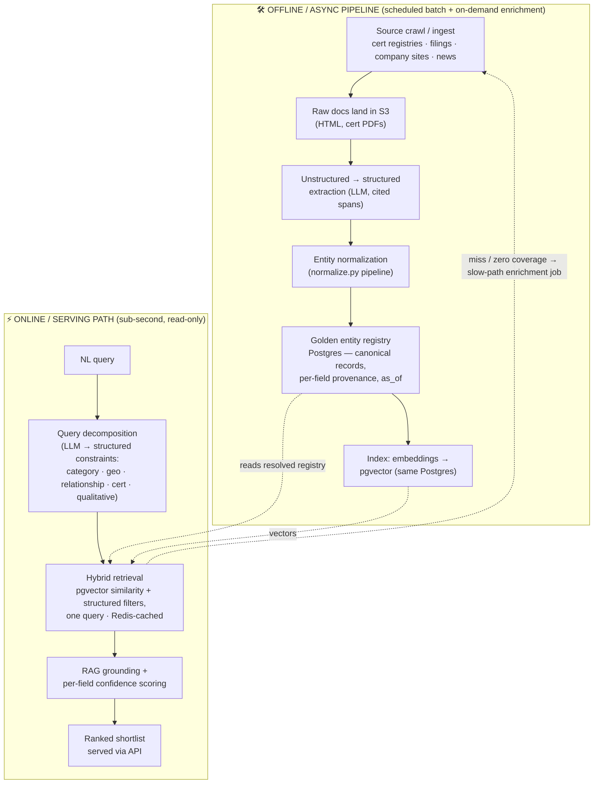

# Supplier Intelligence Engine — Architecture Sketch

> This document sketches the **target production architecture**. Only `normalize.py` is a running prototype — it implements this system's hardest component (entity resolution). Everything else here is *described*, not built.

**The problem, in one line:** a supplier query is not a keyword search — it is a set of **heterogeneous constraints**, some hard facts (country of registration, certification) and some inferred (`established export presence`). **Core insight:** because constraints differ in kind and in trust, confidence must be scored **per field, not per record** — a supplier can be a certain match on geography and a maybe on export presence, and the product must show that seam rather than collapse it into one score.

---

## End-to-end flow (offline pipeline vs. online serving)

Entity resolution runs **offline**, not at query time. The online path reads the already-resolved **golden registry** — resolution is precomputed and cached, never on the request hot path. This offline stage is exactly what `normalize.py` implements: in the verified run it collapses **10 messy records → 8 canonical entities**, idempotently. Its union-find step is what makes it real entity resolution rather than pairwise dedup — three `CATL` records fuse into one even though the acronym-vs-abbreviation pair (`r1↔r3`) scores only **21**, well below threshold, because `r1↔r2` (alias-dict) and `r2↔r3` (fuzzy 89) transitively close the cluster.



---

## Concrete Stack & Scaling Path

Pragmatic startup restraint: name the heavy tool **and** defer it with a trigger, rather than deploy everything on day one.

| Concern | Ship at launch | Scale to | Defer reason / trigger |
|---|---|---|---|
| **Orchestration** | Prefect/Dagster (or cron for first crawls) | Airflow on MWAA/Astronomer | Self-run scheduler cluster is ops-heavy; wait until DAG complexity demands it |
| **Ingest transport** | SQS / Redis-backed job queue | **Kafka** | Ingest is *scheduled batch*, not a firehose; Kafka only when we move to streaming/event-driven ingest |
| **Cache / queue / rate-limit** | **Redis** (Elasticache/Upstash) — result & entity cache, enrichment queue (RQ/Celery), external-API rate tracking | Redis Cluster | Already sufficient; scales in place |
| **Transform (ETL/ELT)** | Python for extraction + resolution; **dbt** for SQL-side transforms & data tests | Spark | Data volume doesn't warrant a distributed engine early |
| **Raw doc landing** | **S3** | S3 + lakehouse table format | Fine as-is at early scale |
| **LLM / embeddings / rerank** | Hosted: small/fast (parse) + mid (extract/synthesis) + cross-encoder reranker | Fine-tuned / self-hosted | Don't own model infra before the token bill justifies it |

**ELT vs. custom T:** structured facts follow **ELT** — load raw, transform in-warehouse with dbt. But **entity resolution is a genuine custom `T` that cannot live in SQL** (blocking, fuzzy, union-find, survivorship) — it's `normalize.py`. So dbt owns tabular transforms; custom code owns resolution.

### Datastore Choices

- **Structured store / golden registry → Postgres.** Holds resolved canonical entities, per-field provenance, `as_of` timestamps, and the source-trust table. Transactional, mature, cheap, already known — the boring correct system of record.
- **Vectors → pgvector *inside the same Postgres* at launch.** A deliberate infrastructure-collapsing call: one datastore to operate/back-up/secure instead of two, and a single query can filter structured constraints (country, cert) **and** do vector similarity with no cross-store join — which is exactly this system's hybrid-retrieval need.
- **Scale to a dedicated vector DB (Pinecone/Weaviate/Qdrant) only when** corpus size or latency outgrows pgvector (rough trigger: **millions of vectors** or **sub-100ms p99 at high QPS**). Naming the trigger makes the deferral a judgment, not an oversight.
- **Redis** — hot cache + queue + rate-limit; **derived/ephemeral, never a system of record.** Postgres is always the source of truth.
- **S3** — raw/unstructured blobs (crawled HTML, cert PDFs); object storage, not a DB. Keep binaries out of Postgres; store extracted facts + a pointer.

> **Principle:** start with the fewest datastores that work — **Postgres + pgvector + Redis + S3** — and split out only when a measured limit forces it. Every added datastore is operational surface area a small team pays for continuously.

---

## Ingestion & Freshness

**How data enters:** scheduled **batch crawls** of cert registries, regulatory filings, company sites, and news; plus **on-demand enrichment** for a queried supplier not yet in the corpus. Raw docs land in S3 → extraction → resolution → registry.

**Per-field TTL — different facts have different staleness clocks:**

| Fact | Refresh cadence | Why |
|---|---|---|
| Certification | expiry date + short re-check TTL (~30d) | Disqualifying and revocable — staleness can fail a procurement audit |
| Revenue | annual / on new filing | Moves slowly, filing-gated |
| Supply relationship | own re-verify schedule (~quarterly) | Changes with contracts, not continuously |

A **re-crawl scheduler** prioritizes *stale-and-high-value* records (see Data Prioritization). **Tradeoff:** the corpus is **eventually consistent**, so the serving path shows each fact's `as_of` date and flags anything past its TTL as **stale** rather than presenting it as current.

## Data Prioritization

One governing idea: **finite crawl/verify/compute budget, spent where correctness matters most.**

1. **Ingest priority** — re-crawl score = **value × staleness**, where value ≈ query demand × source trust × downstream-dependency count. A near-expiry cert on a frequently-queried supplier jumps the queue; an aggregator record for a never-queried supplier sinks.
2. **Field-stakes priority** — hard filters (country, cert) are **disqualifying** (wrong ⇒ whole result invalid); soft signals (`export presence`) are **ranking-only** (wrong ⇒ slight reorder). Verification budget (cross-source checks, slow-path enrichment) goes to disqualifying fields first; lower confidence is accepted on ranking-only ones.
3. **Source priority under conflict** — the source-trust table decides which conflicting value wins.

These are one principle, not three mechanisms.

## Source-Trust Hierarchy

Defined **once**, consumed by **both** normalization survivorship (which value wins) and per-field confidence scoring — trust is not reinvented per stage. (`normalize.py` uses this exact table.)

| Tier | Source | Trust |
|---|---|---|
| 1 | Official cert registry | 1.0 |
| 2 | Regulatory filing | 0.9 |
| 3 | Company website | 0.7 |
| 4 | News | 0.5 |
| 5 | Third-party aggregator | 0.3 |

Rationale: **authoritative → self-reported → third-party.**

---

## Latency vs. Accuracy

Two tiers, chosen per request:

- **Fast path (sub-second)** — cache hit or full registry coverage: serve pre-indexed structured facts + cached vectors. **Trades away** freshness and semantic depth for speed; every field carries `as_of` so staleness is visible.
- **Slow path** — cache miss / zero coverage / confidence below threshold: on-demand enrichment, cross-source verification, LLM re-ranking. Returns partial results immediately and **backfills the registry async** so the *next* identical query is fast.

Decision inputs: cache hit · registry coverage · per-field confidence threshold. What we trade: the slow path spends latency and token budget to buy accuracy, and only when the fast path can't clear the confidence bar.

## Per-Field Confidence

A hard fact (country of registration) scores from **source trust × cross-source agreement** — three sources agreeing at registry tier ⇒ high. An inferred fact (`established export presence`) has no authoritative source, so it scores lower by construction and is treated as **ranking-only**, never a hard filter. Low-confidence or past-TTL fields are **surfaced with an `unverified` / stale flag**, not hidden — the product's job is to show the analyst *what it's unsure about*.

**Live example from the verified `normalize.py` run** — the fused `CATL` cluster (`r1, r2, r3`) shows survivorship reading the **source-trust table**, not naive max-picking:

```
Contemporary Amperex Technology Co., Ltd.   (fused: r1, r2, r3)
  country:        CN          conf 1.00  ✔ cert_registry/r2   (3/3 sources agree)
  revenue (M USD): 32000      conf 0.70  ✔ cert_registry/r2   (conflict [30000,32000,33000]
                                                              → highest-TRUST source wins, NOT max 33000)
  certifications: ISO-9001    conf 1.00  ✔ cert_registry/r2
                  IATF-16949  conf 1.00  ✔ cert_registry/r2
```

Revenue is a ranking-only field, so its lower agreement (three conflicting values) discounts confidence to 0.70 but the record survives; a disqualifying field with the same disagreement would instead flag `unverified`. This is the deterministic-by-mandate survivorship — no LLM picks the surviving value, which is what keeps re-runs idempotent.

## Observability & Feedback Loop

Procurement analysts **accept / reject / correct** shortlist rows. Those corrections are captured as labels that flow back into the golden registry and the (week-one) **evaluation set**, closing the loop so resolution quality **improves with usage** instead of drifting. This is also the label source that eventually justifies switching on per-stage model routing and the cross-checker (see LLM Usage Map).

---

## Failure Modes & Graceful Degradation

Two governing principles: **(a) fail safe over fail merged** — for the one irreversible op (entity merge), uncertainty defaults to *not acting* (an unmerged duplicate is recoverable; a wrong merge silently corrupts); **(b) degrade, don't error** — every fallback returns a usable, honestly-labeled result. Fallbacks **reuse primitives already in the design** (confidence score, `unverified` flag, `as_of`, review queue) — resilience wasn't bolted on.

**These principles fired in the verified run, not just on paper.** The stubbed LLM proposed merging `Panasonic Holdings` with `Panasonic Energy` on a shared brand token (conf 0.66); the deterministic gate found no ≥-threshold support and **refused the merge** — *LLM proposes, rules dispose*, and *fail-safe over fail-merged* in one decision (logged, `r4↔r5`). The two entities were instead **linked** `parent_of` / `subsidiary_of`. Separately, `LG Energy Solution` vs `LG Chem` shared a brand token and a division keyword but no parent keyword, so direction was undetermined — the pipeline **routed it to human review** as `affiliate_of` rather than guess a hierarchy. Both are the same design, exercised.

| Break point | Fallback | Principle |
|---|---|---|
| LLM query parser fails / malformed | Rule/regex extraction of structured filters; flag **"reduced parse mode"** | degrade |
| Vector store / retrieval down | Pure structured SQL filter on registry (country/cert/category are exact-match); lose semantic recall, not the query | degrade |
| Enrichment source times out / rate-limited | Serve cached registry with stale `as_of`; queue enrichment async; backfill next time — never block on a live third-party call | degrade |
| Extraction LLM low-confidence on a field | Write field `unverified` and surface it; field degrades, record survives | degrade |
| Merge cross-checker disagrees / unavailable | **Do not merge**; keep entities separate, flag for review | fail safe |
| No results clear all hard filters | Relax **soft** constraints first; return near-misses labeled **"matched 4/5 criteria"** | degrade |
| Zero registry coverage for queried supplier | Trigger slow-path enrichment, return partial now, backfill registry | degrade |

---

## Worked Query Trace (the actual test query)

> *"Lithium-ion battery cell manufacturers in Japan or South Korea that supply to automotive OEMs, with ISO-9001 or IATF-16949 certification and an established export presence."*

**Decomposes to:**
```
category:       li-ion battery cell mfg
geography:      {any_of: [JP, KR]}
relationship:   {supplies_to: automotive OEM}
certifications: {any_of: [ISO-9001, IATF-16949]}
qualitative:    [established export presence]
```

| Constraint | Hard filter or soft signal | Resolved by |
|---|---|---|
| category | hard | registry category field (exact) |
| geography JP/KR | hard | registry `country` exact-match (ISO-normalized in resolution) |
| certification | hard | registry `certifications`, with `as_of` / TTL check |
| supplies-to OEM | hard **iff** cited | **deterministic** — cited structured source; else left `unverified`, never asserted |
| export presence | **soft (ranking-only)** | scored from signals (export filings, ports), not filtered |

**One result row (served):**
```
LG Energy Solution Ltd.
  country:        KR          conf 1.00  ✔ cert_registry   as_of 2024
  certifications: IATF-16949  conf 1.00  ✔ cert_registry   as_of 2024
  supplies_to:    [Hyundai, GM]          ✔ cited filing    as_of 2024
  export_presence: 0.72 (ranking signal, not a gate)
  match: 5/5 hard criteria
```

---

## LLM Usage Map

**Governing principle: use the smallest sufficient model per stage, and add a model to a stage only where it clears a bar cheaper deterministic logic cannot.** The LLM lives at the **two ends** of the pipeline (language-in, language-out) and is **excluded from the high-risk deterministic core**. A *second* model appears in **exactly one** place — an independent cross-checker on merge proposals — because that is the one low-volume, high-stakes decision worth a second opinion. **No LLM is used for any stage tagged HIGH risk.**

| Stage | LLM role | Model tier | Risk | Guardrail |
|---|---|---|---|---|
| Query decomposition | Primary | small/fast | LOW | schema-constrained / function-calling; feeds filters, not stored facts |
| Constraint typing (hard vs. soft) | Primary | small/fast | LOW | drives filter-vs-score routing, never a stored value |
| Blocking / retrieval | — | **embedding model** (non-LLM) | LOW | only widens candidate pool; a later stage confirms |
| Unstructured→structured extraction | Primary | mid | MEDIUM | **mandatory cited source span** + `llm-extraction` provenance; no span → not promoted to verified |
| **Relationship inference** ("supplies to OEM") | **excluded (HIGH)** | none | HIGH | **deterministic-only** — cited structured source / public record with a hard link; if only inferrable, left `unverified`. *The system's most dangerous potential LLM use — off-limits.* |
| **Field survivorship** (which revenue/country/cert wins) | **excluded (HIGH)** | none | HIGH | **deterministic-only** — source-trust, recency, set-union. LLM never picks/generates a surviving value. Idempotent. |
| Merge & hierarchy proposals | Assist | mid proposer **+ 2nd different-family cross-checker** | MEDIUM | LLM *proposes only* into staging with a confidence score; cross-checker judges the same pair — agree ⇒ raise confidence, disagree ⇒ human review; **rules dispose, never autocommit**. The **one** place a 2nd model is justified (low volume, high stakes) |
| RAG synthesis ("why it matches") | Primary | mid | MEDIUM | writes prose over retrieved docs only; unsupported constraint rendered `unverified`, never fabricated |
| Re-ranking on soft signals | — | **cross-encoder** (non-LLM) | LOW | operates last on a small filtered set; cheaper/better than an LLM for ordering |
| Conversational refinement | Primary | small/fast | LOW | reuses query-decomposition; produces filter deltas, not facts |

**Seen in the prototype:** `normalize.py` stubs the merge proposer as `llm_propose_merge()` and shows the discipline concretely — its proposals for `Panasonic Holdings↔Energy` and `LG Energy↔Chem` were treated as untrusted signals, gated, and **refused** (proposes, never autocommits); the ambiguous `LG` pair **routed to human review** as `affiliate_of`. At launch this ships single-family (proposer only); the second-family cross-checker switches on once the eval set proves its gain.

**Through-line:** models are a **recall-and-language engine, not a source of truth**; smallest sufficient model per stage; a second model **only** as the merge cross-checker; the HIGH-risk core (relationship truth, field survivorship) is deterministic by mandate. This orchestration is **architected in but shipped single-family at launch** — per-stage routing and the cross-checker switch on only once the evaluation set (see Decision Log) makes their accuracy gains measurable.
